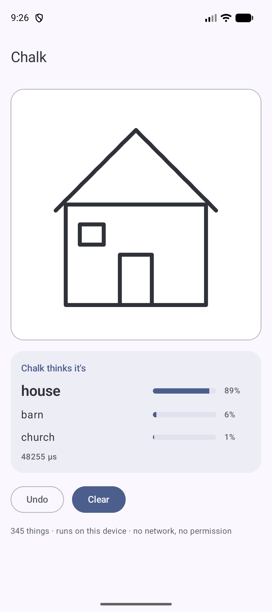
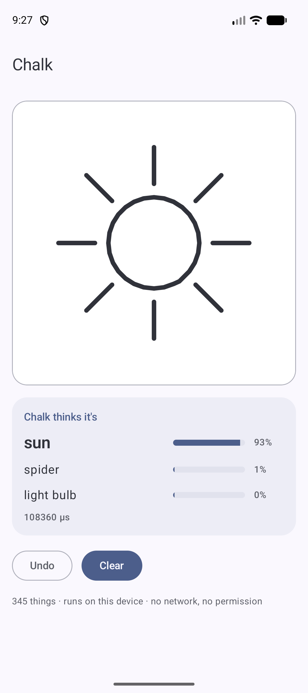
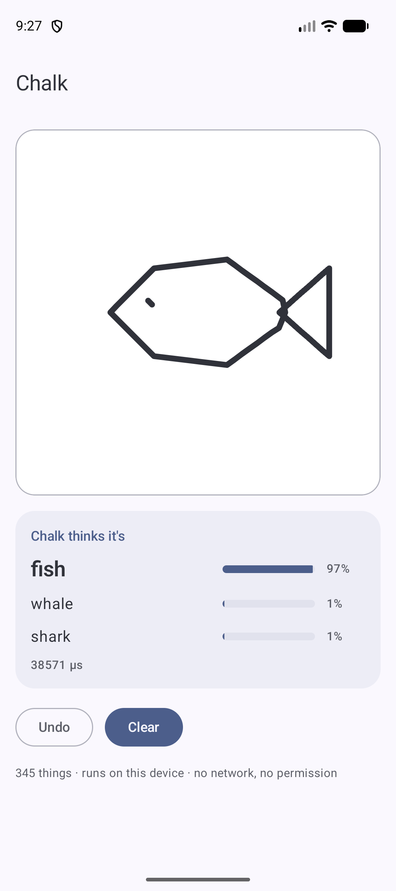
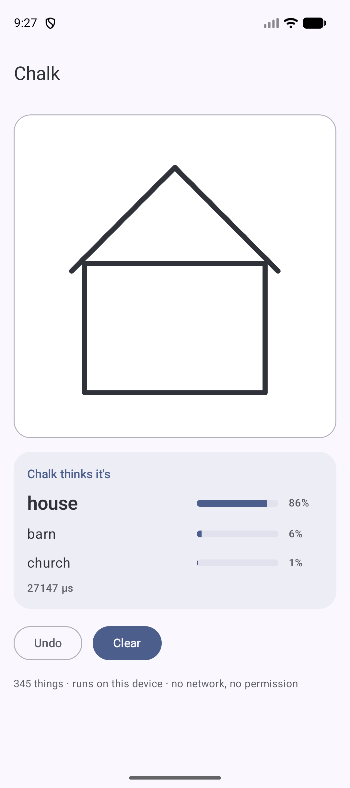
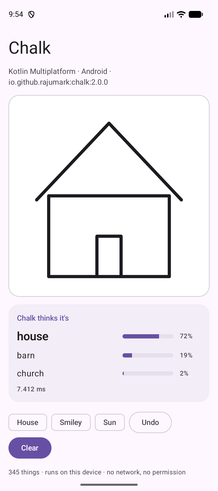
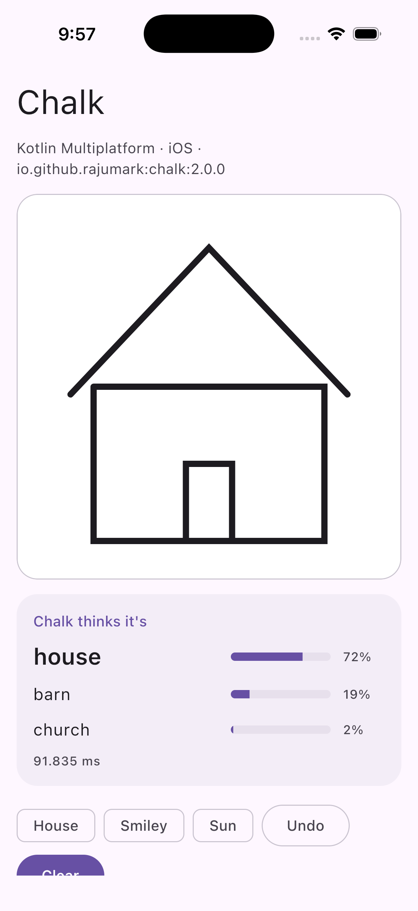
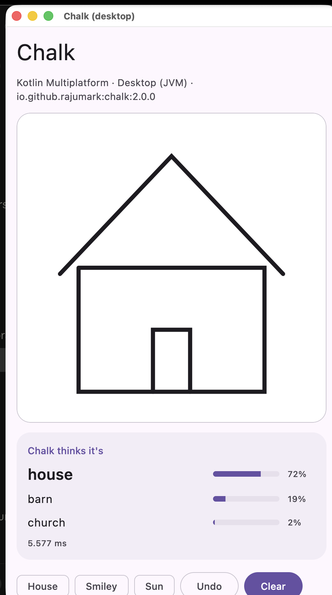
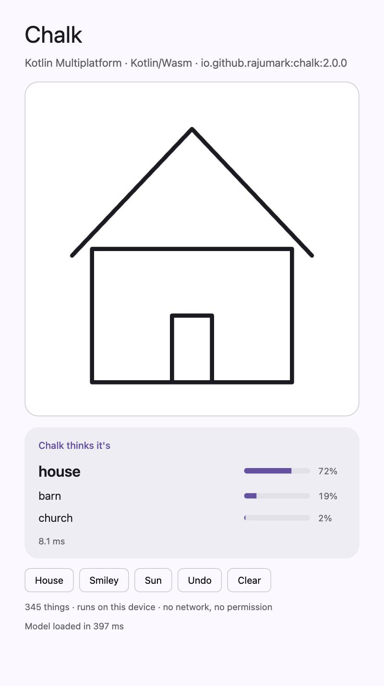

# Chalk 🖍️

By Hoverfly. On-device doodle recogniser for **Kotlin Multiplatform**: Android, iOS, macOS, JVM desktop, JavaScript and WebAssembly. It reads the pen strokes of a drawing and guesses what it is,
out of 345 everyday things (cat, house, bicycle, pizza, the Eiffel Tower …), even before the drawing is finished.

```kotlin
import io.github.rajumark.hoverfly.chalk.Chalk
import io.github.rajumark.hoverfly.chalk.Stroke

Chalk().use { chalk ->
    chalk.guess(strokes)     // strokes from your drawing view, in screen pixels
    // a house drawn with 4 strokes:
    // [Guess(label=house, score=0.89), Guess(label=barn, score=0.06), Guess(label=church, score=0.01)]
}
```

- **Reads strokes, not pixels.** Pass the points your finger drew; size and position on screen don't matter.
- **Guesses while you draw.** Works on half-finished drawings, like the Quick, Draw! game.
- **345 things**, the Google QuickDraw categories: animals, food, vehicles, objects, shapes, landmarks.
- **Tiny.** 1.7 MB of int8 weights, 81% top-1 and 94% top-3 on 345 categories.
- **No dependencies.** Inference is plain Kotlin. There is no ONNX Runtime, TFLite, ML Kit or native code.
- **Private and offline.** The model ships inside the library on every platform. There is no network, no permission and no telemetry.
- **Every platform, same results.** Android, iOS, macOS, JVM desktop, JavaScript and WebAssembly, tested against the reference model on each.

## Install

```kotlin
// build.gradle.kts: commonMain, or any platform source set
dependencies {
    implementation("io.github.rajumark:chalk:2.0.0")
}
```

It's on Maven Central, so no extra repository is needed. Gradle picks the right artifact for each platform:

| Platform | Artifact |
|---|---|
| Android (minSdk 21) | `chalk-android` |
| JVM desktop (Java 8+) | `chalk-jvm` |
| iOS device and simulator (arm64) | `chalk-iosarm64`, `chalk-iossimulatorarm64` |
| macOS (arm64) | `chalk-macosarm64` |
| JavaScript (browser, Node) | `chalk-js` |
| WebAssembly (browser, Node) | `chalk-wasm-js` |

The Android-only 1.x releases are on JitPack: `com.github.rajumark:chalk:v1.x`.

Upgrading from 1.x on Android: `Chalk(context)` still compiles in Kotlin (deprecated). The model no longer needs a `Context`, so switch to `Chalk()`. Java code must change `new Chalk(context)` to `new Chalk()`.

## Screenshots

The sample app on an emulator. Every guess is computed on the device.

| House | Sun | Fish | Half-drawn |
|---|---|---|---|
|  |  |  |  |
| house 89% | sun 93% | fish 97% | walls + roof: house 86% |

The KMP sample on each platform:

| Android | iOS | Desktop | Web (Wasm) |
|---|---|---|---|
|  |  |  |  |

## Use

```kotlin
val chalk = Chalk()            // loads the model: do it off the main thread, keep one instance

// one Stroke per finger-down ... finger-up, points in any coordinates
val square = Stroke.of(100f, 100f, 900f, 100f, 900f, 900f, 100f, 900f, 100f, 100f)
chalk.guess(listOf(square))           // [Guess(label=square, ...), Guess(label=picture frame, ...), ...]
chalk.guess(strokes, count = 5)       // the 5 best guesses
chalk.probabilities(strokes)          // a probability for every label, in the order of chalk.labels
chalk.labels                          // the 345 labels

chalk.close()                         // frees the model's memory
```

`guess()` is thread-safe. Call it after every stroke, or every few points while the finger moves, to guess live.

From a Compose `pointerInput` or a `View.onTouchEvent`, collect the points of each stroke:

```kotlin
val strokes = mutableListOf<Stroke>()
// on finger up:
strokes += Stroke(xs.toFloatArray(), ys.toFloatArray())
val best = chalk.guess(strokes).firstOrNull()
```

From Java:

```java
try (Chalk chalk = new Chalk()) {
    List<Guess> guesses = chalk.guess(strokes);
}
```

### API

| | |
|---|---|
| `Chalk()` | Loads the bundled model. `AutoCloseable`. |
| `guess(strokes, count = 3)` | The `count` most likely labels, best first, as `Guess(label, score)`. Empty for no points. |
| `probabilities(strokes)` | A probability for every label (order of `labels`), or `null` for no points. |
| `labels` | The 345 labels, as QuickDraw names them (`"cat"`, `"hot air balloon"`, `"The Eiffel Tower"`). |
| `Stroke(x, y)` / `Stroke.of(x0, y0, x1, y1, …)` | One stroke: the points from finger-down to finger-up. |

## Quality

Top-1 = the first guess is right; top-3 = the right answer is among the first three. Measured on QuickDraw drawings
never used for training (500 per category), through the same touch-input pipeline the library uses.

| | Chalk | BEiT-base sketch classifier | MobileViT-small (QuickDraw) |
|---|---|---|---|
| Finished drawings: top-1 / top-3 | 81.5% / 94.3% | **83.3% / 95.6%** | 70.6% / 87.9% |
| Half-drawn (first half of the strokes): top-1 / top-3 | **53.3% / 73.9%** | 50.1% / 69.7% | 40.4% / 59.7% |
| Size | **1.8 MB** | 348 MB | 21 MB |
| Latency, one drawing, 1 CPU thread (laptop) | **~1 ms** | ~69 ms | ~2.5 ms |

The image models get each drawing rendered as a picture first (BEiT exactly as its model card documents, MobileViT
with the rendering it scores best on). On all 172,500 test drawings Chalk scores 81.0% top-1 and 94.4% top-3, and
about the same for drawings from every country (India 80.4%, US 81.1%, UK 80.3%).

A 200× larger image model is 1.8 points more accurate on finished drawings; Chalk is better at guessing while the
user is still drawing, at a size that fits in any app. In the pure-Kotlin library a guess takes about 13 ms on a laptop
JVM (the Python numbers above use SIMD), 25 ms on an Android emulator and 50–90 ms in a browser (JS or Wasm).

**Where it falls short:** some categories look alike when drawn quickly: the hardest are marker, bear, garden hose,
aircraft carrier, cooler and cup (34–45% top-1), while helicopter, angel, wine glass, star, ladder and The Mona Lisa
are 97–98%. Very neat computer-made shapes are harder than hand-drawn ones (a perfect triangle is a close call between
"triangle" and "see saw"). It only knows the 345 QuickDraw categories, so anything else gets the nearest one.

## Sample apps

`sample/` is a separate Gradle build that uses the **published** library, never the source. It resolves `io.github.rajumark` only from Maven Local, or from Maven Central with `-PchalkRepo=central`. It has a Compose Multiplatform app for Android, desktop and iOS, and a web page built for both Kotlin/JS and Kotlin/Wasm.

```bash
./gradlew :chalk:publishToMavenLocal
cd sample
./gradlew :androidApp:installRelease
./gradlew :desktopApp:run
./gradlew :webApp:wasmJsBrowserDevelopmentRun     # or :webApp:jsBrowserDevelopmentRun
open iosApp/iosApp.xcodeproj                       # run the iosApp scheme on a simulator
```

## Project layout

```
chalk/                         the library
  src/commonMain/              public API (Chalk, Stroke, Guess) and the model in plain Kotlin
                               (internal/: Strokes (simplification), Network, Hypot)
  src/{jvm,android,embedded}Main/   the only platform code: model loading
  src/modelData/               chalk.bin (int8 weights) · labels.txt
  src/commonTest/              parity with the reference on 150 drawings, API, latency; runs on every target
  src/jvmTest/                 checks the common hypot against StrictMath.hypot, bit for bit
sample/                        demo apps using the published artifacts
docs/                          website (rajumark.github.io/chalk)
```

On JVM and Android the model ships as Java resources in the jar/AAR. Kotlin/Native and the web have no resources, so the build compiles it into the library (`generateEmbeddedModel`).

## Tests

```bash
./gradlew :chalk:jvmTest
./gradlew :chalk:testAndroidHostTest
./gradlew :chalk:connectedAndroidDeviceTest              # on a connected device/emulator
./gradlew :chalk:iosSimulatorArm64Test
./gradlew :chalk:macosArm64Test
./gradlew :chalk:jsNodeTest :chalk:jsBrowserTest
./gradlew :chalk:wasmJsNodeTest :chalk:wasmJsBrowserTest
```

The parity tests start from screen-like float coordinates and require the same simplified points, the same top-3 guesses and probabilities within 0.002 of the reference implementation on all 150 test drawings, on every target. Simplification uses one fdlibm `hypot` in common code, because the platforms' own `hypot` functions round differently in rare cases and that can change which points are kept.

## How it works

The strokes are simplified the way Google simplified the QuickDraw data: aligned to the top-left, scaled so the longer
side is 255, resampled every unit and reduced with the Ramer-Douglas-Peucker algorithm. Each remaining point (at most
128) becomes a token with its position, its step from the previous point and whether it starts or ends a stroke. A
small transformer (4 layers, 1.6M parameters, int8 weights with one scale per row) reads the points in drawing order
and averages them into one vector, which picks the category. It was trained with random rotations, stretches, thinned
points and half-finished drawings, so real finger input and unfinished drawings work.

## Publishing

See [PUBLISHING.md](PUBLISHING.md).

## Pricing & license

**Free for up to 10,000 monthly active devices.** You don't need an API key, an account or a license file: add the dependency and ship. It works in commercial apps too, with no limit on how often each device runs it.

| | Community | Commercial | Custom models |
|---|---|---|---|
| **Price** | Free | Contact us | Contact us |
| **For** | Products with up to 10,000 monthly active devices per platform | Products above 10,000 monthly active devices on any platform | A model trained for your own language, domain or task |
| **Includes** | Commercial use, unlimited calls, no key or sign-up | One license per product per model, direct support, early access to updates | Designed and trained by Hoverfly, shipped as a plain Kotlin library |

**How devices are counted.** A monthly active device is a device that runs Chalk at least once in a calendar month. The limit applies separately to each product, each platform (Android, iOS, web…) and each Hoverfly model. Once a product passes it, you have 30 days to get a commercial license. The library keeps working and never checks in with a server.

**Not allowed** under any tier (unless agreed in writing):

- selling or redistributing Chalk or its model on its own, or inside another SDK or library
- extracting, modifying, fine-tuning or retraining the model weights
- using the model or its outputs to train or distill another model
- reverse engineering the model or its file format
- offering it as a hosted API for others

**Custom models.** Hoverfly also designs and trains small, fast on-device models for your needs: sketch and handwriting recognition, moderation, classification, language detection and more.

**Contact** for a commercial license or a custom model: [raju348636@gmail.com](mailto:raju348636@gmail.com) or **+91 63533 21951** (call or WhatsApp).

Full terms: [Hoverfly Community License](LICENSE).

The model was trained on the [Quick, Draw! dataset](https://github.com/googlecreativelab/quickdraw-dataset) by Google, CC BY 4.0.
